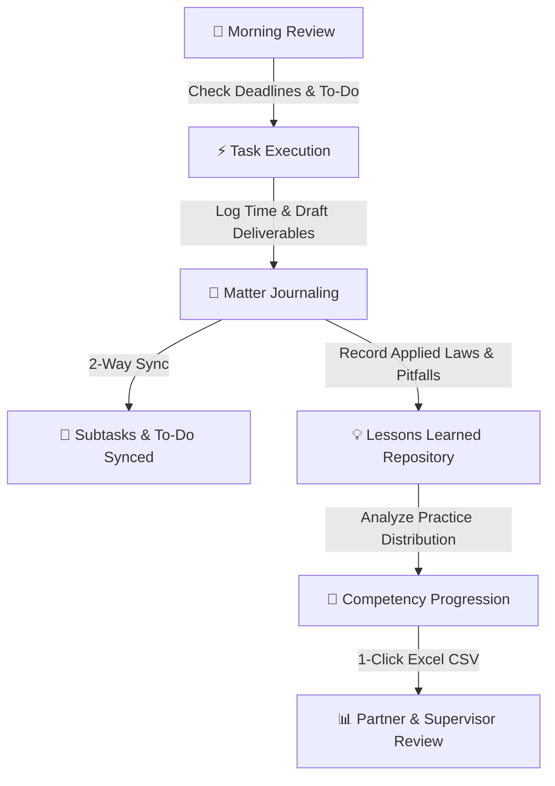

# ⚖️ Dawa (ዳዋ) — Associate Legal Practice Journal & Competency Dashboard

> **Executive Legal Practice Management System tailored for Mehrteab & Getu Advocates LLP (Addis Ababa, Ethiopia)**

[](https://nextjs.org/)
[](https://www.typescriptlang.org/)
[](https://www.mongodb.com/)
[](https://vercel.com/)

---

## 📖 Overview

**Dawa** (from the Ethiopian legal tradition referring to legal claims, matters, and cases) is an executive practice management, competency tracking, and knowledge retention journal designed specifically for legal associates and advocates.

Rather than acting as a simple time sheet, **Dawa** bridges the gap between daily task execution, statutory mastery under Ethiopian law, and long-term career progression across Mehrteab & Getu Advocates LLP's **8 core practice areas**.

---

## 🚀 How to Use Dawa Effectively (User Guide)

Follow this structured workflow to maximize your productivity, maintain supervisor visibility, and build an invaluable repository of legal expertise.



---

### Step 1: The 5-Minute Morning Routine

1. **Check the Deadlines Radar (⏳ Deadlines View)**:
   - Start your day by reviewing matters grouped into **Overdue**, **Due in 48 Hours**, **This Week**, and **Upcoming**.
   - Ensure urgent court filings, licensing renewals at EIC/MOTI, or contract review deadlines are flagged to your supervising partner.
2. **Review the Daily To-Do List (⚡ To-Do View)**:
   - View high-priority tasks and linked matter deliverables.
   - Filter by status or priority to plan your billable day.

---

### Step 2: Logging and Managing Legal Matters

Click the **`+ New Matter`** button in the top navigation bar to open the Matter Dossier modal:

* **Matter Title & Client Reference**: Use standardized naming conventions (e.g., `Acquisition Due Diligence — FinTech Target`, Client: `MLA-CORP-2026-042`).
* **Practice Area**: Select one of the 8 firm practice groups:
  1. `Corporate` (Commercial Code Proclamation No. 1243/2021)
  2. `Tax` (Tax Administration Proclamation No. 983/2016)
  3. `Employment & Immigration` (Labour Proclamation No. 1156/2019)
  4. `Litigation & Arbitration` (Civil Procedure Code & AACCSA rules)
  5. `Finance & Projects` (NBE Directives, foreign exchange regulations)
  6. `IP & Technology` (EIPO Trademarks Proclamation No. 501/2006)
  7. `Mining, Energy & Real Estate` (Mining Operations Proclamation)
  8. `NGO & Civil Society` (CSO Proclamation No. 1113/2019)
* **Supervising Lawyer**: Assign the responsible Partner or Senior Associate (e.g., *Mehrteab Leul*, *Getu Shiferaw*).
* **Hours & Confidence Rating**:
  - **Hours Logged**: Record actual focused time spent.
  - **Confidence Rating (1 to 5)**: Gauge your personal mastery over the subject matter. Ratings below 3 highlight areas where partner consultation or deeper statutory review is recommended.

---

### Step 3: Mastering 2-Way Task & Subtask Synchronization

Dawa features **bidirectional synchronization** between matter subtasks and your daily to-do board:

1. **Adding Subtasks in a Matter**:
   - Inside any Matter card or modal, add individual milestones (e.g., *"Draft Board Resolution"*, *"Review Articles of Association"*, *"File at Ministry of Innovation and Technology"*).
2. **Automatic Reflection**:
   - Every subtask automatically populates in your **Daily To-Do List** with a clickable badge linking back to its parent matter.
3. **Instant 2-Way Updates**:
   - Checking off a task in the **To-Do List** automatically marks that subtask completed inside the Matter, updating the matter's progress bar.
   - Completing subtasks inside the Matter modal instantly marks the item done on your To-Do board.

---

### Step 4: The Reflective Practitioner Loop (Lessons Learned)

The true differentiator of high-performing associates is deliberate reflection:

* **Activities Undertaken**: Document specific work performed (e.g., *"Reviewed draft loan agreement against NBE Directive SBB/77/2020 on external loan registration"*).
* **Skills & Laws Involved**: Tag relevant statutory instruments, court precedents, or procedural guidelines.
* **Lessons Learned**: Answer: *What surprised you? What procedural bottleneck was encountered? What would you do faster next time?*
* **The Lessons View (💡)**:
   - Before drafting a new legal opinion or structure, navigate to the **Lessons Knowledge Base**. Search by keyword (e.g., *"withholding tax"*, *"work permit"*, *"arbitration clause"*) to review insights from previous files.

---

### Step 5: Competency Mapping & Career Development

Navigate to the **🧭 Competency Map** in the sidebar:

* **Hours Distribution vs. Target**: Visual comparison of your actual hours against recommended associate benchmark targets (e.g., 80 hours in Corporate, 75 hours in Litigation, 60 hours in Tax).
* **Practice Breadth Indicator**: Displays your firm-wide coverage (e.g., `6/8 Practice Areas active`).
* **Balanced Growth**: Use this visual feedback during partner one-on-ones to request rotation or assignment to practice areas where you have less exposure.

---

### Step 6: Exporting for Partner Reviews & Billing

* Click **`Export CSV`** in the top navigation bar.
* Dawa generates a structured spreadsheet (`.csv`) encoded with **UTF-8 with BOM**, ensuring proper character rendering in Microsoft Excel and Google Sheets.
* Includes all matter titles, client references, hours, confidence ratings, supervisory partners, lessons, and subtask completion percentages ready for submission.

---

## 🖥️ Views Breakdown

| View | Icon | Purpose |
| :--- | :---: | :--- |
| **All Entries Feed** | 📂 | Grid and list view of all active, pending, and completed client files with real-time search and practice area filters. |
| **Competency Map** | 🧭 | Visual radar of hours logged across all 8 Ethiopian practice areas vs. benchmark targets. |
| **Daily To-Do List** | ⚡ | Interactive checklist featuring standalone tasks and linked matter deliverables with confetti feedback. |
| **Deadlines Radar** | ⏳ | Urgency-sorted timeline highlighting items requiring immediate attention. |
| **Timeline & Hours** | 🕒 | Chronological feed of billable activities with time allocation analytics. |
| **Lessons Base** | 💡 | Searchable repository of lessons learned, legal pitfalls, and statutory insights. |

---

## ⚙️ Architecture & Storage Options

Dawa is built with a dual-persistence engine:

### 1. High-Performance Local Storage (Default)
* Works immediately out-of-the-box in the browser without any setup.
* Data is stored persistently in browser `localStorage`.
* Ideal for personal offline journaling and quick local development.

### 2. MongoDB Atlas Cloud Mode (Optional / Multi-Device)
* Enables serverless API persistence across multiple browsers, tablets, and devices.
* Configured by setting the `MONGODB_URI` environment variable.
* Automatic fallback: If MongoDB is temporarily unreachable or unconfigured, the app falls back safely without breaking.

---

## 🛠️ Local Development & Setup

### Prerequisites
* Node.js 18.x or higher
* npm, yarn, or pnpm

### 1. Clone & Install
```bash
git clone https://github.com/lost-from-ilght/Dawa.git
cd Dawa
npm install
```

### 2. Configure Environment (Optional)
If connecting to MongoDB Atlas, create a `.env.local` file:
```env
MONGODB_URI="mongodb+srv://<username>:<password>@cluster0.mongodb.net/mla_legal_journal?retryWrites=true&w=majority"
```

### 3. Run Development Server
```bash
npm run dev
```
Open [http://localhost:3000](http://localhost:3000) in your browser.

### 4. Production Build Verification
```bash
npm run build
npm run start
```

---

## 🌐 Deploying to Vercel

1. Push your repository to GitHub (already configured on `main`).
2. Import the project into your [Vercel Dashboard](https://vercel.com/new).
3. **Environment Variables**:
   * If using MongoDB Atlas, add `MONGODB_URI` in **Settings $\rightarrow$ Environment Variables**.
   * Ensure your MongoDB Atlas IP Access List permits access from anywhere (`0.0.0.0/0`) for Vercel serverless functions.
4. Click **Deploy**.

---

## 🏛️ Firm & Project Details

* **Law Firm**: Mehrteab & Getu Advocates LLP (Addis Ababa, Ethiopia)
* **Application**: Dawa (Associate Practice Journal & Competency Dashboard)
* **Version**: `0.1.0`
* **Maintainer**: [`lost-from-ilght`](https://github.com/lost-from-ilght)
